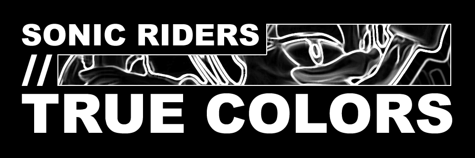
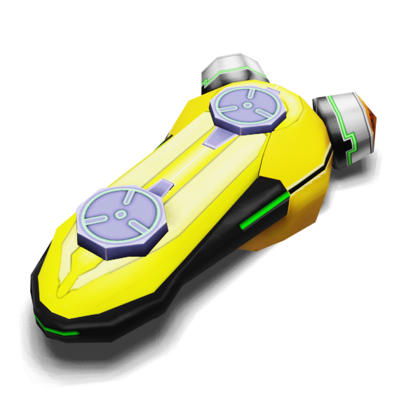
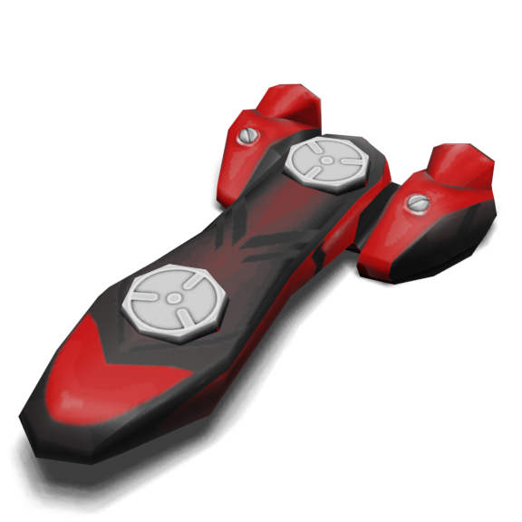
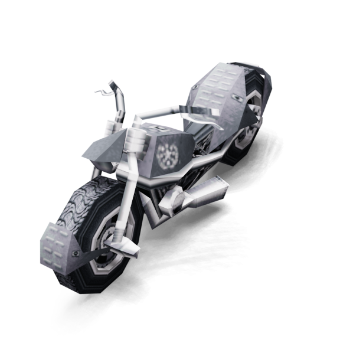
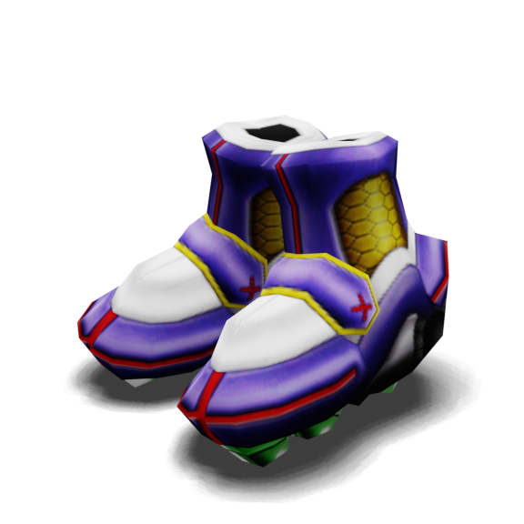

This repository contains all code used for the "Sonic Riders True Colors" project, a modification of Sonic Riders Tournament Edition (SRTE).

Technical information is identical to SRTE, and thus it is recommended to check that repository for more information.

## Content

Sonic Riders True Colors adds the following content to SRTE:
- 15 new playable Extreme Gears.
- A fully functional skin system, adding 2 skins per character (accessible by holding X/Y when selecting your Extreme Gear).
- While hovering over Default Gear, you can press START to cycle through different Default Gears.
- A more curated selection of music and Extreme Gears. Most unmodified SRTE Gears are not available by default, but can be re-enabled by enabling the new "Enable All Gears" Debug feature.
- The ability to play with one CPU in Free Race, for various purposes. This can be enabled by selecting the "Add A Friend" Debug feature.

## Extreme Gears

True Colors adds 15 new fully functional Extreme Gears, with 14 of them having unique stats and abilities.

### Airship


Airship has subpar stats compared to Default Gear, with -10 Boost Speed on all levels while being more Air Efficient. However, it has the ability to "Air Dash" by pressing the X Button while in the Air.

### Greed


Greed's Level is equal to the Lap it's on (maxing out at 3) and does not get any additional stats from Levelling up, but instead gains Boost Speed based on the amount of Rings it holds (Boost Speed = Rings / 2). In addition, Greed has a Ring cap of 200, but loses Rings overtime when above 100. In essence, this means the Gear caps out at 250 Boost Speed normally, but can temporarily go above 250.

### G-Shot


G-Shot has average stats with poor Air Efficiency, but stores the amount of time charging jump as a resource for Boost Control. This allows you to extend your boost while holding the Boost button, and your speed ramps up overtime as well, up to a maximum of 350.

Unfortunately, there is no HUD element to show how much jump charge has been stored for Boost Control.

### Wanted


Designed by Headless Soldier, this Gear goes up to Level 5 and gives different buffs depending on your position in the race.

When in 1st, Wanted grants passive Ring Gain. When in 2nd or lower, Wanted grants additional Boost Speed.

### Shooting Star


A Trick Levelling Gear, which means it levels up based on the amount of Tricks you have done. Level 2 requires 10 total Tricks, Level 3 requires 20.

When above Level 1, Shooting Star grants an additional +60 Landing Speed when landing with an S Rank or lower, at the cost of 20 Rings. If the you do not have 20 Rings, it subtracts 10 Tricks from your total instead, essentially levelling you down.

### Wind Star


A Trick Levelling Gear, which means it levels up based on the amount of Tricks you have done. Level 2 requires 12 total Tricks, Level 3 requires 24.

Wind Star can activate its special "Tailwind" mode by placing down a tornado. While Tailwind is active, you gain Passive Air Gain and +20 Boost Speed in exchange for Passive Ring Drain. Tailwind deactivates once Rings reach 0 or you enter a QTE.

### Road Star


A Trick Levelling Gear, which means it levels up based on the amount of Tricks you have done. Level 2 requires 12 total Tricks, Level 3 requires 24.

While using Road Star, your Boost Chain Multiplier (BCM) scales with the amount of Rings you are holding, at a maximum of +15%.

### Angel/Devil


Angel/Devil starts out at Level 2 with poor stats, but can activate either Angel Mode or Devil Mode by pressing D-Pad Up. Both modes have Passive Ring Drain, and can be manually deactivated by pressing D-Pad Up again.

While in Angel Mode (Level 1), you boost at 255. If you attack someone in this Mode or get attacked yourself, you are forced back to Level 2 and lose all your Rings.

While in Devil Mode (Level 3), you boost at 245 and have enhanced BCM. If your speed falls below 150, you are foced back to Level 2 and lose all your Rings. If you hit someone while in this Mode, you gain 30 Rings.

### Challenger



This Gear is meant to be a minigame rather than a competitive Gear. Challenger randomises your Type and Level every 25 seconds, forcing on-the-fly routing and Air management. You can press D-Pad Up to refill your Air Gauge at the cost of 25 Rings.

Challenger starts out at Level 1 with your original Type. What Type you are can be inferred from the Exhaust Trail and sound effects.

### Executor



Executor rewards you for falling off the stage. When dying, you gain 30 Rings, Level 3 and an incredibly high Boost Speed of 275, "Redeploy Mode". Rings drain passively while in this Mode, and you revert to Level 1 once your Rings reach 0. You also gain an immediate burst of speed upon respawning.

### Skill Link


Skill Link grants you a speed boost upon collecting the exact same type of item twice. The items you pick up are also upgraded (i.e. 10 Rings becomes 20 Rings) at the cost of losing 10 Rings whenever you collect an item box.

### G.U.N. Bike



The G.U.N. Bike is statistically identical to Default Gear

### Reserve Tank


Reserve Tank starts at Level 4, but barely refills any Air from Tricks and cannot enter Pit Stops. At the cost of 1 Level and 25 Rings, you can refill your Air Gauge by pressing D-Pad Up. You can boost for free while the Air Gauge is refilling. Reserve Tank always boosts at 240.

### Shinobi



A Trick Levelling Gear, which means it levels up based on the amount of Tricks you have done. Level 2 requires 15 total Tricks, Level 3 requires 30.

## Credits

Base Sonic Riders content belongs to SEGA/Sonic Team.

SRTE content belongs to Riders Boulevard (the SRTE Team).

Coding/Design/Textures/Porting: Sybille Sirky

Custom Remixes by Sybille

"Wanted" Gear Design: Headless Soldier

Emerl Skin Textures: TitanSparrow

## Special Thanks

The following people have been instrumental for this project, either by testing, consulting or simple motivation.

E-10000F, Exortile, Headless Soldier, Joe a tron, KEVron, KingOfAllBS, NullPTr, Sir Genexis, Supp Ins, TitanSparrow, Trouble, Visualiser_

## Building

Building instructions are copied from the SRTE repository, as they are identical.

### Required packages

* [devkitPro](https://devkitpro.org/wiki/Getting_Started)

Below are required MSYS2 terminal packages (in-depth installation is found in the [instructions](#instructions)):
* mingw-w64-x86_64-python
* mingw-w64-x86_64-cmake
* mingw-w64-x86_64-gcc
* dkp-cmake-common-utils

### Required external libraries

* [SRTE libOGC](https://github.com/Sonic-Riders-Tournament-Edition/libogc-srte) - TE source code is now compiled using a custom version of libOGC rather than the embedded Nintendo Dolphin SDK. Check the [build instructions](#instructions) for compiling this library.

### Instructions

**These instructions are catered to Windows. Instructions may vary on different operating systems.**

For maximum compatibility, you should install devkitPro using their graphical installer, and you should use the MSYS2 terminal included with your devkitPro installation, using the MINGW64 environment. By default, the MSYS2 terminal launches in the MSYS2 environment. To launch it in the MINGW64 environment, run `mingw64.exe` in your devkitPro's MSYS2 installation folder. The following instructions assume you are using the MSYS2 terminal with the proper environment.

1. Make sure your terminal is up to date. Do this via `pacman -Syu`.

2. Make sure you have Python installed in your environment. You can do so via `pacman -S mingw-w64-x86_64-python`.
    1. If this gives you an error saying `error: target not found`, you need to add all the mingw64 repositories to your pacman.
    2. To do this, run `nano /etc/pacman.conf` to open up pacman's configuration in a CLI text editor.
    3. Add the following lines at the bottom of this file:
    ```
    [mingw64]
    Include = /etc/pacman.d/mirrorlist.mingw64
    ```
    4. Press `CTRL+X`, then `Y`, then `Enter` to save changes.
    5. Run `pacman -Syu` to update your changes, then try installing the package again.

3. Make sure you have the correct version of cmake installed. You can do this in the terminal via `pacman -S mingw-w64-x86_64-cmake`.

4. Also make sure you have the following packages installed using these commands: `pacman -S mingw-w64-x86_64-gcc` and `pacman -S dkp-cmake-common-utils`.

5. Last but not least, navigate to your devkitPro folder (usually at `C:\devkitPro`), and go into the `cmake` folder and open `dkp-initialize-path.cmake` with a text editor.

6. Comment out lines 3-5 using the `#` symbol, so that they look like this:
```
#if(CMAKE_HOST_WIN32)
#	message(FATAL_ERROR "CMake must be installed and launched from msys2: pacman -S cmake")
#endif()
```

7. Once that's done, clone the aforementioned custom libOGC library to your computer via `git clone` or any other similar way. **(This step doesn't go through the MSYS2 terminal.)**

8. Once cloned, navigate to the cloned directory in the terminal via the `cd` command. Then run `make cuberiders` to build the library. Once it's built, make sure to note down the full absolute path to this cloned directory. You'll need it in the later steps.

9. Then, clone the source code repository to your computer. **(This step doesn't go through the MSYS2 terminal.)**

10. Once cloned, navigate to the `tools` directory in the terminal using the `cd` command. Then run the `makeTools.sh` script via this command: `./makeTools.sh`.

11. After that, make a new folder in the root folder of the project, where the build files will be generated in. For example, you can name the folder `build`.

12. Navigate into that directory using the `cd` command again. This is where you'll need the path to the libOGC library folder mentioned in step 8. Run the following command to generate the build files, replacing `/path/to/libogc` with your noted down path (NOTE: if on Windows, the path's `\` separators must be using `/` instead!): 
```
$DEVKITPRO/devkitPPC/bin/powerpc-eabi-cmake -DCUSTOM_LIBOGC_PATH=/path/to/libogc ../
```

13. Run `ninja` in the same directory to build the DOL file (you can also run `ninja -j$(nproc --all)` for faster build times). The `main.dol` file will be built and compiled into the same build folder you created.
